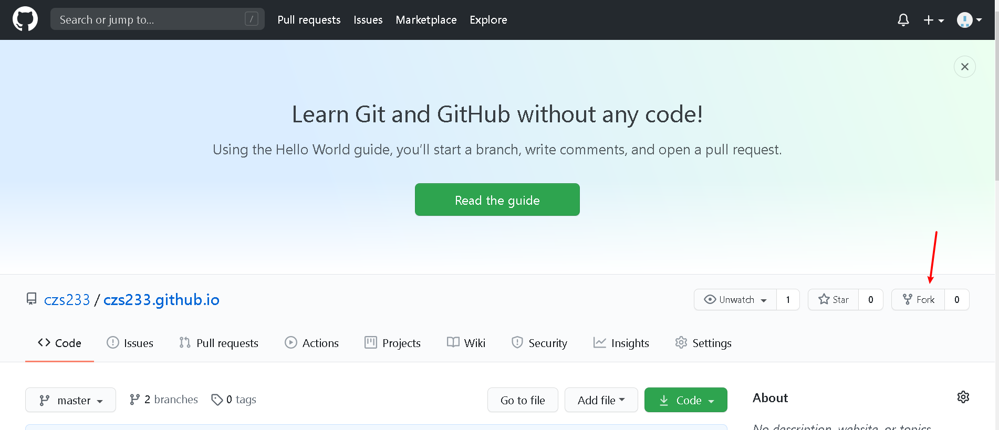
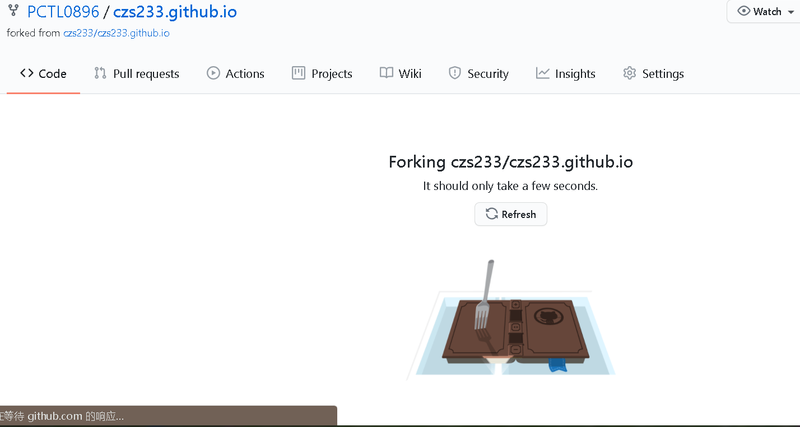

**这是一篇教程！**
# 警告：若你没有足够的耐心，建议找他人代为提交
# 1.准备阶段
你至少需要以下三样东西：
- [32位](https://npm.taobao.org/mirrors/git-for-windows/v2.28.0.windows.1/Git-2.28.0-32-bit.exe)或[64位](https://npm.taobao.org/mirrors/git-for-windows/v2.28.0.windows.1/Git-2.28.0-64-bit.exe)的Git
- [Python3](https://mirrors.huaweicloud.com/python/3.9.0/python-3.9.0a5.exe)
- 一个[Github账号](https://docs.github.com/cn/github/getting-started-with-github/signing-up-for-a-new-github-account)
- 新建一个文件夹用于存储文件

准备好后，便可以进入下一个阶段。
# 2.复制一个你自己的仓库
这时，你应该已经登入了自己的github账号。

接下来，访问[这个网址](https://github.com/czs233/czs233.github.io)

点击如图所示的按钮

然后你应该会看到这个页面

完成后会类似图1，但是czs233/czs233.github.io变为了你的用户名/czs233.github.io
# 以上步骤只需要重复一次
# 3.拉仓库到本地并开始修改
点击绿色的“code”按钮，复制下链接。
接下来，进入你的文件夹，右键点击打开菜单，点击“Git Bash Here”
输入指令git clone 你刚复制的链接。
然后等待执行完成后就可以修改啦！

修改完成后，点击"提交脚本"就可提交至你的仓库。
如需要输入你的github账号密码请输入
# 4.提交至主仓库
访问https://github.com/替换为你的用户名/czs233.github.io/pulls
点击绿色按钮
再点一下绿色按钮，然后你就将文档提交到了主仓库。
但是这还没完。重新访问以上页面，单击箭头所指的选项，打开下拉菜单，左右均选择gh-pages，重复点击绿色按钮，提交完毕！
# 教程 完
如果不想每次都输入账号密码，可以看一看[这篇文章](https://blog.csdn.net/qq_15437667/article/details/51029757)
